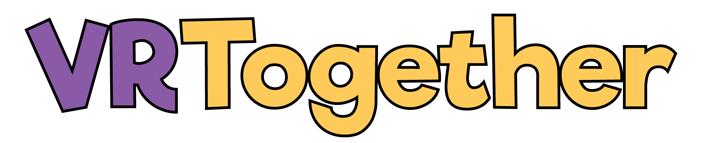
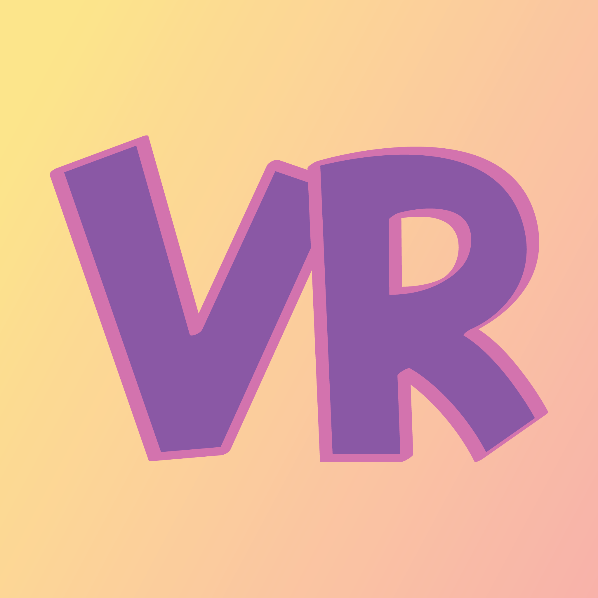

VR Together is a cross-platform virtual reality multiplayer video game. VR Together aims to solve the issue of virtual reality multiplayer gaming being highly inaccessible to due to expensive hardware and space requirements. VR Together only requires a single headset to play multiple minigames, while other players can join on the fun using their mobile devices.

# Team Members
* Alex Kastanek
* Bryce Monaco
* Nathan Navaro Griffin
* Ronn Quijada

# Minigames
* Fly Swatter
* Chicken Shooter
* Spoop House
* Cup Hunt
* Beat Boxer

